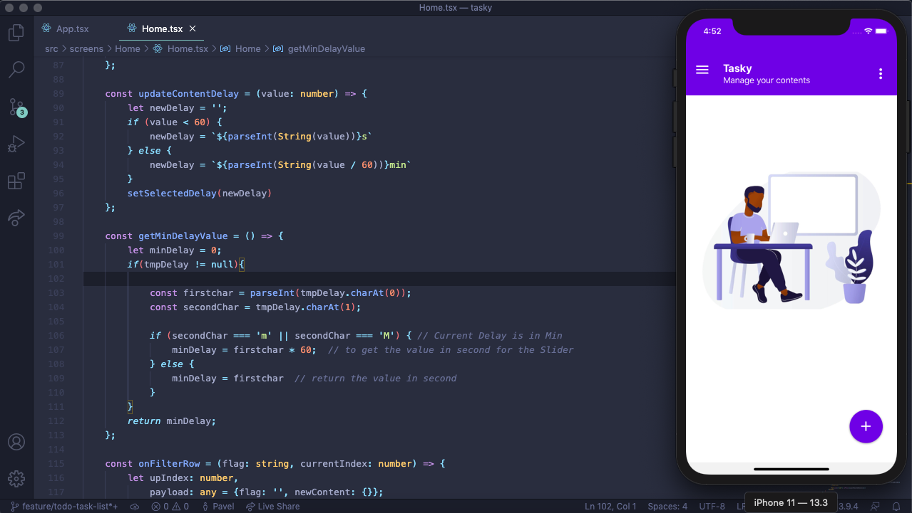
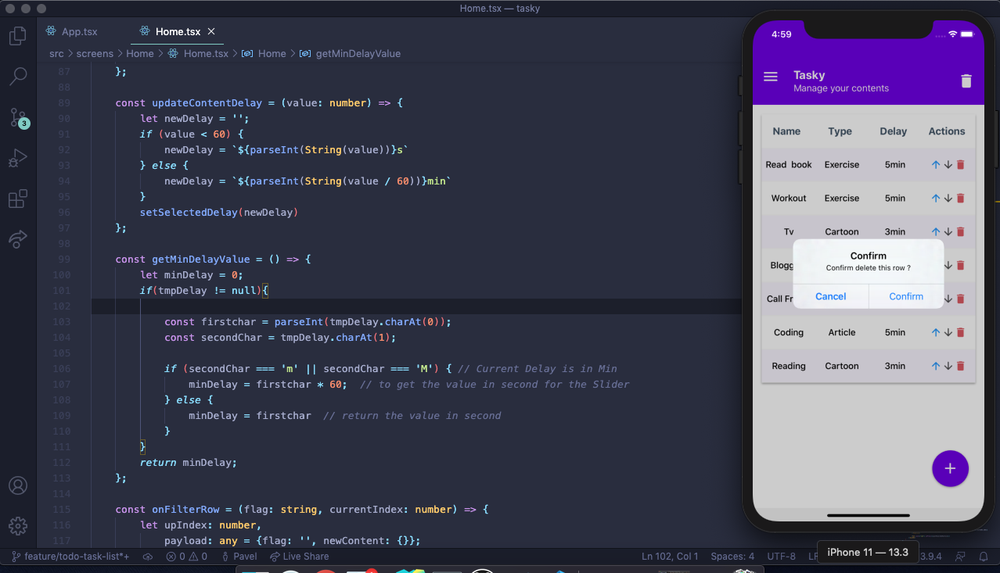
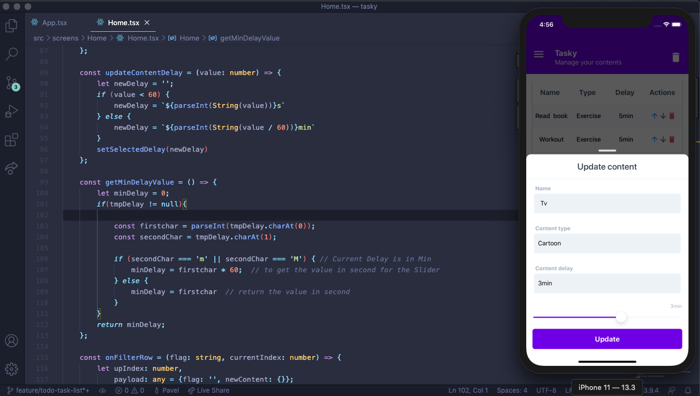

<p align="center">
    
</p>


# Tasky 

>A Todo/Task application thad showcase CRUD operatons in React Native application
 This App is built with React Native with React.JS (Used React Hooks), Redux and Typescript. 
 
 ## Results
- [x] Splashscreen
- [x] List all Task in Table
- [x] Add new Task
- [x] Edit task
- [x] Delete task
- [x] Change Task Order By filtering (UP and DOWN)
- [x] Working on iPhone and Android Devices (Tested)
- [x] Responsive (Iphones and Tablets)


##  Home


##  List


##  Edit / Add



### Dependencies

 - React Js (Used with React Hooks) + Typescript
 - React Native
 - Expo SDK
 - Others (See package.json at the root folder)
 
 ## Get Started
 
 #### 1. Clone the Repo
 
 On the command prompt run the following commands
 ```sh
 $ git clone https://github.com/Doha26/Tasky.git
 
 $ cd Tasky
 
 $ yarn  OR npm install (if you are using npm )

 $ yarn start
 
 ```
 
 ### Author
 
 *	[Pavel Foujeu](mailto:foujeupavel@gmail.com)  
 
 * [](https://twitter.com/Pavel_FFP)
   [](https://www.linkedin.com/in/pavel-foujeu-8a8992142/)
   [](https://github.com/Doha26)

 ### Done with React-native
 
 *	[Instagram Clone ](https://github.com/Doha26/Instagram-clone)
 *	[MetFlix ](https://github.com/Doha26/MetFlix)
 *	[Facebook challenge ](https://github.com/Doha26/Facebook-React-native)

